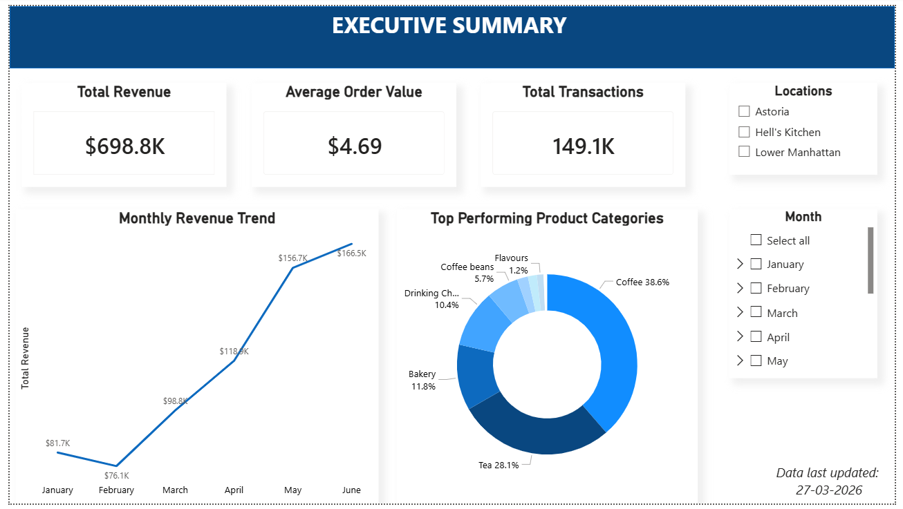
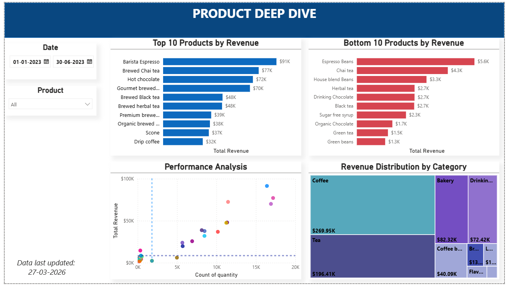
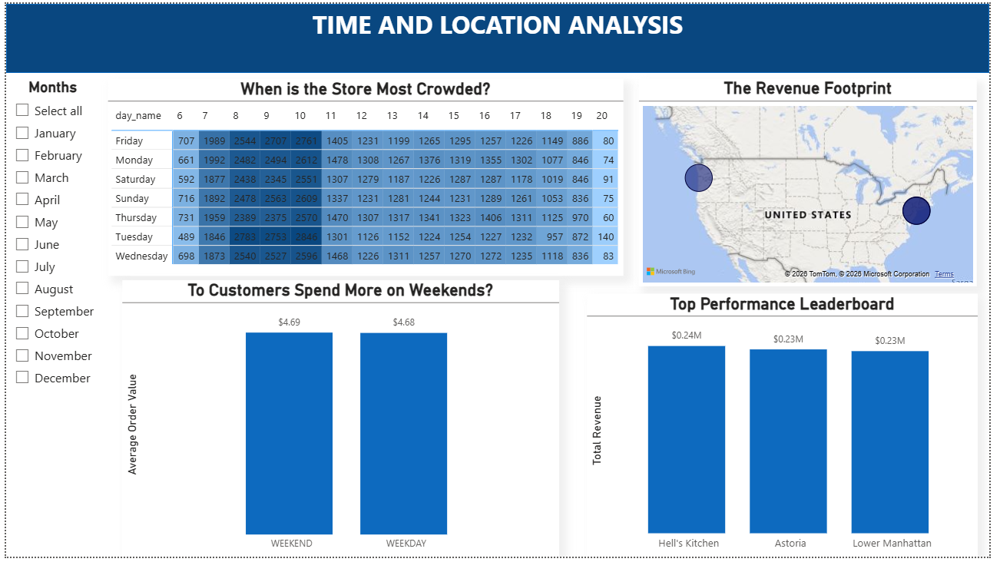

# ☕ End-to-End Coffee Shop Sales Analysis

A complete business intelligence project analysing sales performance across a coffee shop chain — from raw transactional data to an interactive dashboard — using SQL, Excel, and Power BI.

---

## 📌 Project Overview

This project performs an end-to-end sales analysis for a coffee shop chain using real-world transactional data. The goal is to uncover actionable insights around revenue trends, product performance, peak hours, and store-level comparisons to support data-driven business decisions.

---

## 📌 Dashboard Previews




---

## 🛠 Skills Demonstrated

- Data Cleaning & Preparation (Excel)
- Exploratory Data Analysis (EDA)
- Business KPI Analysis (Revenue, AOV, Transactions)
- Time-Based Analysis (Hourly, Daily, Monthly trends)
- Pivot Tables & Advanced Excel Functions
- SQL for Data Aggregation & Querying
- Data Visualization & Dashboard Design (Power BI)
- Sales Performance Analysis (Products & Categories)
- Store-Level Performance Comparison
- Insight Generation & Business Recommendations

---

## 🛠️ Tools & Technologies

| Tool | Purpose |
|------|---------|
| **Excel** | Data cleaning, pivot tables, preliminary exploration |
| **SQL** | Data querying, aggregation, and transformation |
| **Power BI** | Interactive dashboard and data visualisation |

---

## 📊 Key Business Questions Answered

- What are the monthly and weekly revenue trends?
- Which product categories and items drive the most sales?
- What are the peak hours and busiest days of the week?
- How do individual store locations compare in performance?
- What is the average order value across different time periods?

---

## 📁 Project Structure

```
End-to-End-Coffee-Shop-Sales-Analysis/
│
├── data/
│   └── Coffee Shop Sales Raw Data.xlsx        # Raw transactional dataset
│   └── Coffee Shop Sales Working Data.csv     # Cleaned Dataset used in analysis
│
├── excel/
│   └── Coffee Shop Sales Analysis.xlsx         # Cleaned data, pivot tables & charts
│
├── sql/
│   └── 01_table creation.sql            #  All 7 SQL queries
│   └── 02_data_import.sql
│   └── 03_data_cleaning_transformation.sql
│   └── 04_data_quality_audit.sql
│   └── 05_product_performance_analysis.sql
│   └── 06_sales_trends_time_analysis.sql
│   └── 07_location_intelligence.sql

│
├── dashboard/
│   └── dashboards.pbix   # Power BI dashboard file
│
├── screenshots/
│   └── dashboard_1.png      # 3 Dashboard  images
│   └── dashboard_2.png
│   └── dashboard_3.png   
│
└── README.md
```

---

## 🔍 Analysis Workflow

1. **Data Collection** — Raw transactional data loaded from Excel source file
2. **Data Cleaning** — Handled missing values, standardised date formats, removed duplicates in Excel
3. **Exploratory Analysis** — Used SQL queries to explore patterns in sales, footfall, and revenue
4. **Aggregation & Transformation** — Created summary tables segmented by product, location, time, and category
5. **Visualisation** — Built an interactive Power BI dashboard with dynamic filters and KPI cards

---

## 📈 Dashboard Highlights

- **Revenue trend** by month and day of week
- **Top 10 products** by quantity sold and revenue
- **Hourly heatmap** to identify peak footfall windows
- **Store-level comparison** with location filters
- **KPI cards** for Total Revenue, Total Orders, and Average Order Value

> 📸 See `screenshots/dashboard_preview.png` for a full dashboard preview.

---

## 🗄️ Key SQL Queries

Sample queries used in this project:

```sql
-- Monthly revenue trend
SELECT 
    MONTH(transaction_date) AS month,
    SUM(unit_price * transaction_qty) AS total_revenue
FROM coffee_sales
GROUP BY MONTH(transaction_date)
ORDER BY month;

-- Top 5 best-selling products
SELECT 
    product_detail,
    SUM(transaction_qty) AS total_units_sold
FROM coffee_sales
GROUP BY product_detail
ORDER BY total_units_sold DESC
LIMIT 5;

-- Peak hours by transaction count
SELECT 
    HOUR(transaction_time) AS hour_of_day,
    COUNT(transaction_id) AS total_transactions
FROM coffee_sales
GROUP BY HOUR(transaction_time)
ORDER BY total_transactions DESC;
```

---

## 💡 Key Insights

- **Morning hours (8 AM – 10 AM)** consistently generate the highest transaction volume across all locations.
- **Coffee** accounts for the largest share of revenue of 38.6%, followed by **tea** and **bakery items**.
- **Hell's Kitchen** location outperforms other stores in total revenue.
- **Friday** is the peak day of the week for sales across all branches.

---

## 🚀 Getting Started

### Prerequisites
- Microsoft Excel 2021 
- SQL environment ( PostgreSQL )
- Power BI Desktop (free download at [powerbi.microsoft.com](https://powerbi.microsoft.com))

### Steps to Reproduce

1. **Clone the repository**
   ```bash
   git clone https://github.com/dibyashreee/End-to-End-Coffee-Shop-Sales-Analysis.git
   ```

2. **Open the dataset**
   - Navigate to `data/Coffee Shop Sales Raw Data.xlsx`

3. **Run SQL queries**
   - Import the dataset into your SQL environment
   - Execute queries from `sql/sales_analysis_queries.sql`

4. **Explore the Excel analysis**
   - Open `excel/Coffee Shop Sales Analysis.xlsx` to view pivot tables and charts

5. **View the dashboard**
   - Open `dashboard/dashboards.pbix` in Power BI Desktop

---

## 📚 Dataset

- **Source:** Maven Analytics — Coffee Shop Sales Dataset
- **Records:** ~150,000 transactions
- **Period:** January 2023 – June 2023
- **Columns:** transaction_id, transaction_date, transaction_time, store_location, product_category, product_detail, unit_price, transaction_qty


---

## 🙋 About the Author

**Dibyashree Dey**

Data Analyst | SQL • Excel • Power BI

**LinkedIn:** www.linkedin.com/in/dibyashreedey 

**Email:** dibyashree15dey01@gmail.com

---


*If you found this project helpful, please consider giving it a ⭐ — it helps others discover it!*
